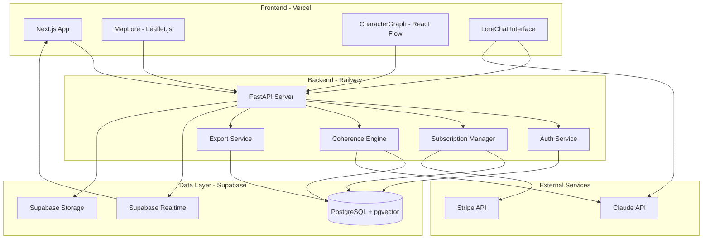
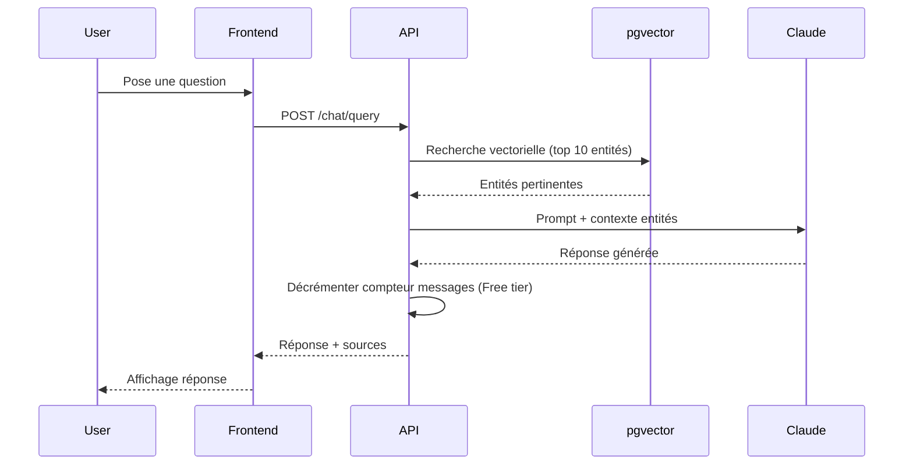
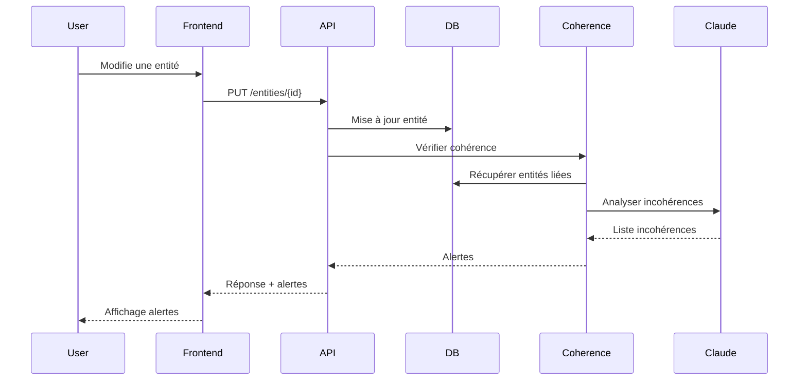

# Design Document - LoreOS

## Overview

LoreOS est une plateforme SaaS de worldbuilding qui permet aux écrivains de créer, gérer et maintenir la cohérence d'univers fictifs complexes. Le système adopte une architecture modulaire où chaque module (MapLore, CharacterGraph, ChronicleForge, etc.) gère un aspect spécifique du worldbuilding tout en partageant un modèle de données unifié.

### Architecture Principles

- **Modularité**: Chaque module est indépendant mais interconnecté via un système de cross-references
- **Cohérence par l'IA**: Un moteur d'IA central (Coherence Engine) analyse les relations entre entités pour détecter les incohérences
- **RAG (Retrieval-Augmented Generation)**: LoreChat utilise pgvector pour rechercher efficacement dans les entités avant de générer des réponses contextuelles
- **Real-time collaboration**: Supabase Realtime permet la synchronisation instantanée pour les équipes Studio
- **Scalabilité**: Architecture découplée frontend/backend permettant une mise à l'échelle indépendante

### Key Design Decisions

1. **PostgreSQL + pgvector**: Choix d'une base relationnelle avec extension vectorielle plutôt qu'une base vectorielle dédiée pour simplifier l'architecture et maintenir les relations complexes entre entités
2. **FastAPI**: Framework Python moderne avec typage fort et génération automatique de documentation OpenAPI
3. **Next.js**: Framework React avec SSR pour optimiser le SEO et les performances de chargement initial
4. **Supabase**: Solution tout-en-un pour authentification, base de données et real-time, réduisant la complexité opérationnelle
5. **Stripe**: Solution de paiement éprouvée avec webhooks pour synchroniser automatiquement les abonnements

## Architecture

### System Architecture



### Data Flow

#### LoreChat Query Flow




#### Coherence Engine Flow



### Technology Stack

| Layer | Technology | Justification |
|-------|-----------|---------------|
| Frontend | Next.js 14 + TypeScript | SSR, App Router, optimisation automatique |
| UI Components | Tailwind CSS | Rapidité de développement, cohérence visuelle |
| Maps | Leaflet.js | Léger, extensible, support mobile |
| Graphs | React Flow | Performant, personnalisable, gestion automatique du layout |
| Backend | Python 3.11 + FastAPI | Typage fort, async natif, écosystème IA riche |
| Database | PostgreSQL 15 | Robustesse, ACID, support JSON |
| Vector Search | pgvector | Intégration native PostgreSQL, simplicité |
| Authentication | Supabase Auth | OAuth, JWT, gestion sessions |
| Real-time | Supabase Realtime | WebSockets, synchronisation automatique |
| Storage | Supabase Storage | CDN intégré, gestion permissions |
| LLM | Claude 3.5 Sonnet | Contexte 200k tokens, qualité réponses |
| Payments | Stripe | Webhooks, gestion abonnements |
| Hosting Backend | Railway | Déploiement simple, scaling automatique |
| Hosting Frontend | Vercel | Edge network, intégration Next.js |

## Components and Interfaces

### Backend API Structure

```
/api/v1
├── /auth
│   ├── POST /register
│   ├── POST /login
│   ├── POST /logout
│   ├── POST /reset-password
│   └── GET /verify-email
├── /users
│   ├── GET /me
│   ├── PUT /me
│   └── DELETE /me
├── /universes
│   ├── GET /
│   ├── POST /
│   ├── GET /{id}
│   ├── PUT /{id}
│   ├── DELETE /{id}
│   └── POST /{id}/collaborators
├── /entities
│   ├── GET /
│   ├── POST /
│   ├── GET /{id}
│   ├── PUT /{id}
│   ├── DELETE /{id}
│   └── GET /{id}/cross-references
├── /maps
│   ├── GET /universe/{universe_id}
│   ├── POST /universe/{universe_id}
│   ├── PUT /{id}
│   └── POST /{id}/markers
├── /characters
│   ├── GET /universe/{universe_id}
│   ├── POST /
│   ├── PUT /{id}
│   ├── DELETE /{id}
│   └── GET /{id}/relationships
├── /chat
│   ├── POST /query
│   ├── GET /history/{universe_id}
│   └── GET /usage
├── /coherence
│   ├── POST /check
│   └── GET /alerts/{universe_id}
├── /timeline
│   ├── GET /universe/{universe_id}
│   ├── POST /events
│   ├── PUT /events/{id}
│   └── DELETE /events/{id}
├── /factions
│   ├── GET /universe/{universe_id}
│   ├── POST /
│   ├── PUT /{id}
│   └── POST /{id}/relationships
├── /pantheon
│   ├── GET /universe/{universe_id}
│   ├── POST /religions
│   ├── POST /deities
│   └── POST /myths
├── /subscriptions
│   ├── GET /plans
│   ├── POST /subscribe
│   ├── POST /cancel
│   └── POST /webhook (Stripe)
├── /export
│   ├── GET /universe/{id}/json
│   ├── GET /character/{id}/pdf
│   └── GET /map/{id}/png
└── /search
    └── GET /
```

### Core Services

#### AuthService
```python
class AuthService:
    async def register(email: str, password: str) -> User
    async def login(email: str, password: str) -> TokenPair
    async def verify_email(token: str) -> bool
    async def reset_password(email: str) -> bool
    async def refresh_token(refresh_token: str) -> TokenPair
    async def logout(user_id: str) -> bool
```

#### SubscriptionService
```python
class SubscriptionService:
    async def get_plans() -> List[Plan]
    async def subscribe(user_id: str, plan_id: str, payment_method: str) -> Subscription
    async def cancel(subscription_id: str) -> bool
    async def check_usage(user_id: str) -> UsageStats
    async def handle_webhook(event: StripeEvent) -> bool
    async def reset_monthly_limits() -> None  # Cron job
```

#### LoreChatService
```python
class LoreChatService:
    async def query(user_id: str, universe_id: str, question: str) -> ChatResponse
    async def get_history(universe_id: str, limit: int) -> List[Message]
    async def check_quota(user_id: str) -> QuotaStatus
    async def embed_entities(universe_id: str) -> None  # Génère embeddings
```

#### CoherenceService
```python
class CoherenceService:
    async def check_entity(entity_id: str) -> List[Incoherence]
    async def check_temporal(event_ids: List[str]) -> List[Incoherence]
    async def check_geographical(location_ids: List[str]) -> List[Incoherence]
    async def check_relational(entity_id: str) -> List[Incoherence]
    async def dismiss_alert(alert_id: str) -> bool
```

#### ExportService
```python
class ExportService:
    async def export_universe_json(universe_id: str) -> bytes
    async def export_character_pdf(character_id: str) -> bytes
    async def export_map_png(map_id: str, width: int, height: int) -> bytes
    async def export_timeline_pdf(universe_id: str) -> bytes
```

### Frontend Components

#### Core Layout
```typescript
// app/layout.tsx
- Navbar (search, notifications, user menu)
- Sidebar (module navigation)
- Main content area
- Toast notifications
```

#### Module Components
```typescript
// MapLore
- MapCanvas (Leaflet wrapper)
- MarkerEditor
- LayerControls
- MapExport

// CharacterGraph
- GraphCanvas (React Flow wrapper)
- CharacterCard
- RelationshipEditor
- GraphFilters

// LoreChat
- ChatInterface
- MessageList
- QuotaIndicator
- SourceCitations

// ChronicleForge
- TimelineView
- EventEditor
- CalendarConfig
- TimelineFilters

// FactionEngine
- FactionGraph
- FactionCard
- RelationshipMatrix
- TerritoryMap

// PantheonForge
- ReligionEditor
- DeityTree
- MythEditor
- PantheonGraph
```

## Data Models

### Core Entities

#### User
```sql
CREATE TABLE users (
    id UUID PRIMARY KEY DEFAULT gen_random_uuid(),
    email VARCHAR(255) UNIQUE NOT NULL,
    password_hash VARCHAR(255) NOT NULL,
    created_at TIMESTAMP DEFAULT NOW(),
    updated_at TIMESTAMP DEFAULT NOW(),
    email_verified BOOLEAN DEFAULT FALSE,
    subscription_tier VARCHAR(20) DEFAULT 'free' CHECK (subscription_tier IN ('free', 'pro', 'studio')),
    stripe_customer_id VARCHAR(255),
    notification_preferences JSONB DEFAULT '{}'
);

CREATE INDEX idx_users_email ON users(email);
CREATE INDEX idx_users_stripe ON users(stripe_customer_id);
```

#### Universe
```sql
CREATE TABLE universes (
    id UUID PRIMARY KEY DEFAULT gen_random_uuid(),
    owner_id UUID NOT NULL REFERENCES users(id) ON DELETE CASCADE,
    name VARCHAR(255) NOT NULL,
    description TEXT,
    created_at TIMESTAMP DEFAULT NOW(),
    updated_at TIMESTAMP DEFAULT NOW(),
    settings JSONB DEFAULT '{}',  -- calendar config, etc.
    is_template BOOLEAN DEFAULT FALSE
);

CREATE INDEX idx_universes_owner ON universes(owner_id);
CREATE INDEX idx_universes_template ON universes(is_template) WHERE is_template = TRUE;
```

#### Entity (Polymorphic base)
```sql
CREATE TABLE entities (
    id UUID PRIMARY KEY DEFAULT gen_random_uuid(),
    universe_id UUID NOT NULL REFERENCES universes(id) ON DELETE CASCADE,
    entity_type VARCHAR(50) NOT NULL,  -- 'character', 'location', 'event', 'faction', 'deity', etc.
    name VARCHAR(255) NOT NULL,
    description TEXT,
    attributes JSONB DEFAULT '{}',  -- Flexible schema per type
    embedding VECTOR(1536),  -- Claude embeddings
    created_at TIMESTAMP DEFAULT NOW(),
    updated_at TIMESTAMP DEFAULT NOW(),
    created_by UUID REFERENCES users(id),
    updated_by UUID REFERENCES users(id)
);

CREATE INDEX idx_entities_universe ON entities(universe_id);
CREATE INDEX idx_entities_type ON entities(entity_type);
CREATE INDEX idx_entities_embedding ON entities USING ivfflat (embedding vector_cosine_ops);
CREATE INDEX idx_entities_name_search ON entities USING gin(to_tsvector('english', name || ' ' || description));
```

#### CrossReference
```sql
CREATE TABLE cross_references (
    id UUID PRIMARY KEY DEFAULT gen_random_uuid(),
    source_entity_id UUID NOT NULL REFERENCES entities(id) ON DELETE CASCADE,
    target_entity_id UUID NOT NULL REFERENCES entities(id) ON DELETE CASCADE,
    relationship_type VARCHAR(100),  -- 'lives_in', 'member_of', 'occurred_at', etc.
    metadata JSONB DEFAULT '{}',
    created_at TIMESTAMP DEFAULT NOW(),
    UNIQUE(source_entity_id, target_entity_id, relationship_type)
);

CREATE INDEX idx_cross_refs_source ON cross_references(source_entity_id);
CREATE INDEX idx_cross_refs_target ON cross_references(target_entity_id);
```

### Module-Specific Models

#### Map
```sql
CREATE TABLE maps (
    id UUID PRIMARY KEY DEFAULT gen_random_uuid(),
    universe_id UUID NOT NULL REFERENCES universes(id) ON DELETE CASCADE,
    name VARCHAR(255) NOT NULL,
    geojson JSONB NOT NULL,  -- Continents, islands, terrain
    bounds JSONB,  -- [[minLat, minLng], [maxLat, maxLng]]
    created_at TIMESTAMP DEFAULT NOW(),
    updated_at TIMESTAMP DEFAULT NOW()
);

CREATE TABLE map_markers (
    id UUID PRIMARY KEY DEFAULT gen_random_uuid(),
    map_id UUID NOT NULL REFERENCES maps(id) ON DELETE CASCADE,
    entity_id UUID REFERENCES entities(id) ON DELETE CASCADE,
    lat DECIMAL(10, 8) NOT NULL,
    lng DECIMAL(11, 8) NOT NULL,
    marker_type VARCHAR(50),  -- 'city', 'mountain', 'forest', etc.
    label VARCHAR(255),
    icon VARCHAR(100),
    created_at TIMESTAMP DEFAULT NOW()
);

CREATE INDEX idx_map_markers_map ON map_markers(map_id);
CREATE INDEX idx_map_markers_entity ON map_markers(entity_id);
```

#### Character
```sql
-- Characters use entities table with entity_type='character'
-- attributes JSONB contains:
{
    "age": 25,
    "gender": "female",
    "species": "human",
    "occupation": "warrior",
    "custom_fields": {...}
}

CREATE TABLE character_relationships (
    id UUID PRIMARY KEY DEFAULT gen_random_uuid(),
    character_a_id UUID NOT NULL REFERENCES entities(id) ON DELETE CASCADE,
    character_b_id UUID NOT NULL REFERENCES entities(id) ON DELETE CASCADE,
    relationship_type VARCHAR(50) NOT NULL,  -- 'family', 'friend', 'enemy', 'ally'
    description TEXT,
    strength INTEGER CHECK (strength BETWEEN 1 AND 10),  -- Intensité de la relation
    created_at TIMESTAMP DEFAULT NOW(),
    CHECK (character_a_id < character_b_id)  -- Éviter doublons
);

CREATE INDEX idx_char_rels_a ON character_relationships(character_a_id);
CREATE INDEX idx_char_rels_b ON character_relationships(character_b_id);
```

#### Timeline
```sql
CREATE TABLE timeline_events (
    id UUID PRIMARY KEY DEFAULT gen_random_uuid(),
    universe_id UUID NOT NULL REFERENCES universes(id) ON DELETE CASCADE,
    entity_id UUID REFERENCES entities(id) ON DELETE SET NULL,
    title VARCHAR(255) NOT NULL,
    description TEXT,
    event_date JSONB NOT NULL,  -- Flexible: {"year": 1250, "month": 3, "day": 15} ou custom calendar
    category VARCHAR(100),
    created_at TIMESTAMP DEFAULT NOW(),
    updated_at TIMESTAMP DEFAULT NOW()
);

CREATE INDEX idx_timeline_universe ON timeline_events(universe_id);
CREATE INDEX idx_timeline_date ON timeline_events USING gin(event_date);
```

#### Faction
```sql
-- Factions use entities table with entity_type='faction'
-- attributes JSONB contains:
{
    "ideology": "democracy",
    "resources": ["gold", "iron"],
    "territory_ids": ["uuid1", "uuid2"]
}

CREATE TABLE faction_relationships (
    id UUID PRIMARY KEY DEFAULT gen_random_uuid(),
    faction_a_id UUID NOT NULL REFERENCES entities(id) ON DELETE CASCADE,
    faction_b_id UUID NOT NULL REFERENCES entities(id) ON DELETE CASCADE,
    relationship_type VARCHAR(50) NOT NULL,  -- 'alliance', 'war', 'neutral', 'trade'
    since_date JSONB,
    description TEXT,
    created_at TIMESTAMP DEFAULT NOW(),
    CHECK (faction_a_id < faction_b_id)
);

CREATE INDEX idx_faction_rels_a ON faction_relationships(faction_a_id);
CREATE INDEX idx_faction_rels_b ON faction_relationships(faction_b_id);
```

#### Pantheon
```sql
-- Religions use entities table with entity_type='religion'
-- Deities use entities table with entity_type='deity'
-- attributes JSONB for deity contains:
{
    "domains": ["war", "justice"],
    "symbols": ["sword", "scales"],
    "alignment": "lawful good"
}

CREATE TABLE deity_relationships (
    id UUID PRIMARY KEY DEFAULT gen_random_uuid(),
    deity_a_id UUID NOT NULL REFERENCES entities(id) ON DELETE CASCADE,
    deity_b_id UUID NOT NULL REFERENCES entities(id) ON DELETE CASCADE,
    relationship_type VARCHAR(50) NOT NULL,  -- 'parent', 'sibling', 'rival', 'spouse'
    description TEXT,
    created_at TIMESTAMP DEFAULT NOW()
);

CREATE TABLE myths (
    id UUID PRIMARY KEY DEFAULT gen_random_uuid(),
    universe_id UUID NOT NULL REFERENCES universes(id) ON DELETE CASCADE,
    religion_id UUID REFERENCES entities(id) ON DELETE CASCADE,
    title VARCHAR(255) NOT NULL,
    content TEXT NOT NULL,
    related_deities UUID[],  -- Array of deity IDs
    created_at TIMESTAMP DEFAULT NOW(),
    updated_at TIMESTAMP DEFAULT NOW()
);

CREATE INDEX idx_myths_universe ON myths(universe_id);
CREATE INDEX idx_myths_religion ON myths(religion_id);
```

### Subscription & Usage

#### Subscription
```sql
CREATE TABLE subscriptions (
    id UUID PRIMARY KEY DEFAULT gen_random_uuid(),
    user_id UUID NOT NULL REFERENCES users(id) ON DELETE CASCADE,
    stripe_subscription_id VARCHAR(255) UNIQUE,
    plan VARCHAR(20) NOT NULL CHECK (plan IN ('free', 'pro', 'studio')),
    status VARCHAR(20) NOT NULL,  -- 'active', 'canceled', 'past_due'
    current_period_start TIMESTAMP,
    current_period_end TIMESTAMP,
    created_at TIMESTAMP DEFAULT NOW(),
    updated_at TIMESTAMP DEFAULT NOW()
);

CREATE INDEX idx_subscriptions_user ON subscriptions(user_id);
CREATE INDEX idx_subscriptions_stripe ON subscriptions(stripe_subscription_id);
```

#### ChatUsage
```sql
CREATE TABLE chat_usage (
    id UUID PRIMARY KEY DEFAULT gen_random_uuid(),
    user_id UUID NOT NULL REFERENCES users(id) ON DELETE CASCADE,
    universe_id UUID NOT NULL REFERENCES universes(id) ON DELETE CASCADE,
    month DATE NOT NULL,  -- First day of month
    message_count INTEGER DEFAULT 0,
    created_at TIMESTAMP DEFAULT NOW(),
    updated_at TIMESTAMP DEFAULT NOW(),
    UNIQUE(user_id, universe_id, month)
);

CREATE INDEX idx_chat_usage_user_month ON chat_usage(user_id, month);
```

#### ChatHistory
```sql
CREATE TABLE chat_messages (
    id UUID PRIMARY KEY DEFAULT gen_random_uuid(),
    universe_id UUID NOT NULL REFERENCES universes(id) ON DELETE CASCADE,
    user_id UUID NOT NULL REFERENCES users(id) ON DELETE CASCADE,
    question TEXT NOT NULL,
    answer TEXT NOT NULL,
    sources JSONB,  -- Array of entity IDs used
    created_at TIMESTAMP DEFAULT NOW()
);

CREATE INDEX idx_chat_messages_universe ON chat_messages(universe_id);
CREATE INDEX idx_chat_messages_created ON chat_messages(created_at DESC);
```

### Collaboration

#### Collaborator
```sql
CREATE TABLE collaborators (
    id UUID PRIMARY KEY DEFAULT gen_random_uuid(),
    universe_id UUID NOT NULL REFERENCES universes(id) ON DELETE CASCADE,
    user_id UUID NOT NULL REFERENCES users(id) ON DELETE CASCADE,
    role VARCHAR(20) NOT NULL CHECK (role IN ('owner', 'editor', 'reader')),
    invited_at TIMESTAMP DEFAULT NOW(),
    accepted_at TIMESTAMP,
    UNIQUE(universe_id, user_id)
);

CREATE INDEX idx_collaborators_universe ON collaborators(universe_id);
CREATE INDEX idx_collaborators_user ON collaborators(user_id);
```

#### ActivityLog
```sql
CREATE TABLE activity_logs (
    id UUID PRIMARY KEY DEFAULT gen_random_uuid(),
    universe_id UUID NOT NULL REFERENCES universes(id) ON DELETE CASCADE,
    user_id UUID NOT NULL REFERENCES users(id) ON DELETE SET NULL,
    entity_id UUID REFERENCES entities(id) ON DELETE SET NULL,
    action VARCHAR(50) NOT NULL,  -- 'created', 'updated', 'deleted'
    changes JSONB,  -- Diff of changes
    created_at TIMESTAMP DEFAULT NOW()
);

CREATE INDEX idx_activity_universe ON activity_logs(universe_id);
CREATE INDEX idx_activity_created ON activity_logs(created_at DESC);
```

### Coherence & Alerts

#### CoherenceAlert
```sql
CREATE TABLE coherence_alerts (
    id UUID PRIMARY KEY DEFAULT gen_random_uuid(),
    universe_id UUID NOT NULL REFERENCES universes(id) ON DELETE CASCADE,
    entity_ids UUID[] NOT NULL,  -- Entities involved in incoherence
    alert_type VARCHAR(50) NOT NULL,  -- 'temporal', 'geographical', 'relational'
    severity VARCHAR(20) NOT NULL CHECK (severity IN ('low', 'medium', 'high')),
    description TEXT NOT NULL,
    dismissed BOOLEAN DEFAULT FALSE,
    dismissed_by UUID REFERENCES users(id),
    dismissed_at TIMESTAMP,
    created_at TIMESTAMP DEFAULT NOW()
);

CREATE INDEX idx_alerts_universe ON coherence_alerts(universe_id);
CREATE INDEX idx_alerts_dismissed ON coherence_alerts(dismissed) WHERE dismissed = FALSE;
```

### Export & Backup

#### Backup
```sql
CREATE TABLE backups (
    id UUID PRIMARY KEY DEFAULT gen_random_uuid(),
    universe_id UUID NOT NULL REFERENCES universes(id) ON DELETE CASCADE,
    backup_data JSONB NOT NULL,  -- Full universe snapshot
    size_bytes BIGINT,
    created_at TIMESTAMP DEFAULT NOW()
);

CREATE INDEX idx_backups_universe ON backups(universe_id);
CREATE INDEX idx_backups_created ON backups(created_at DESC);
```

